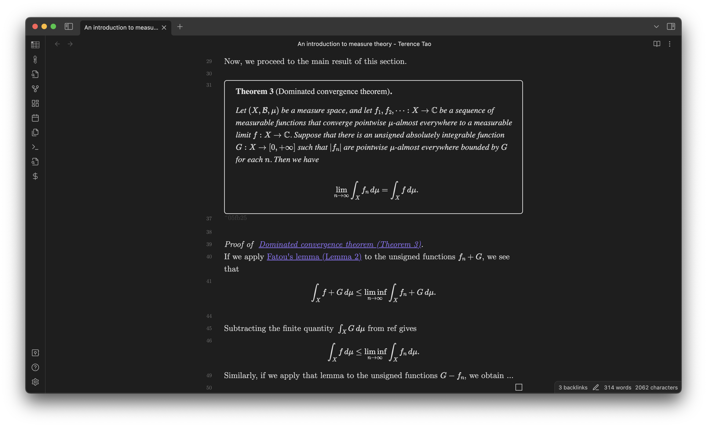
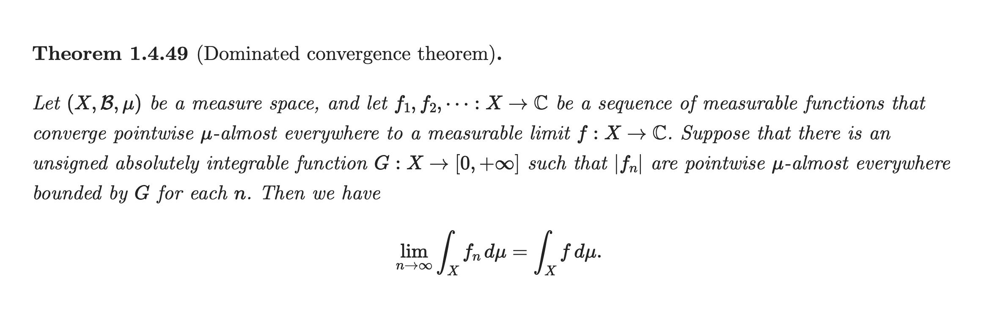
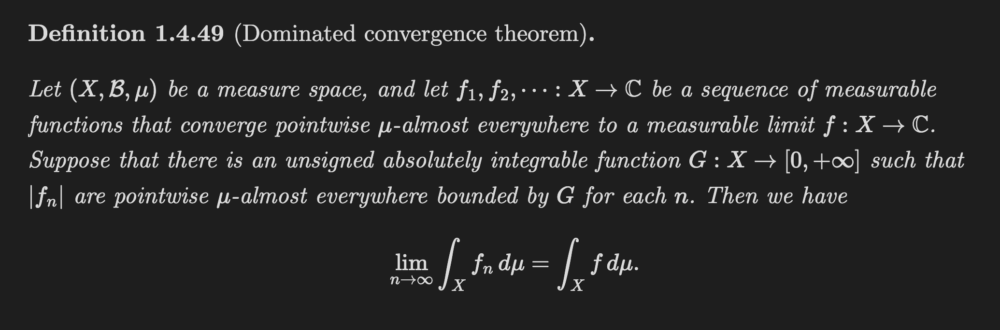
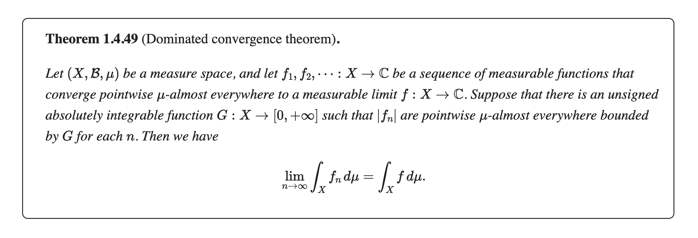
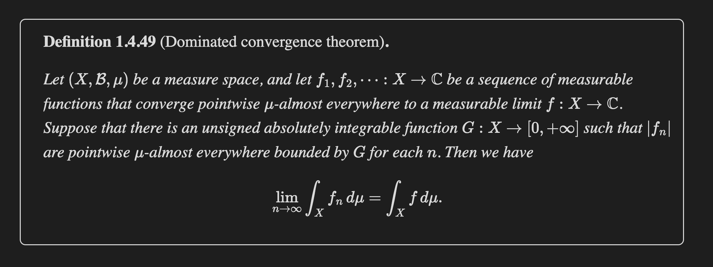
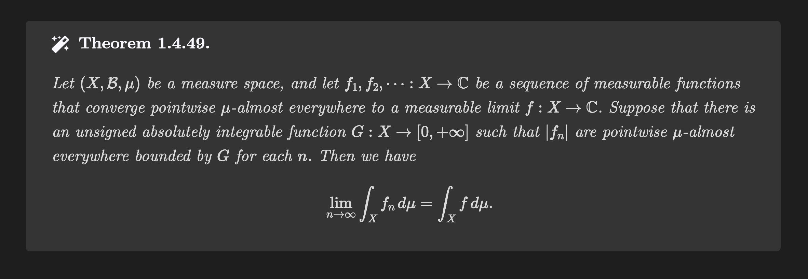
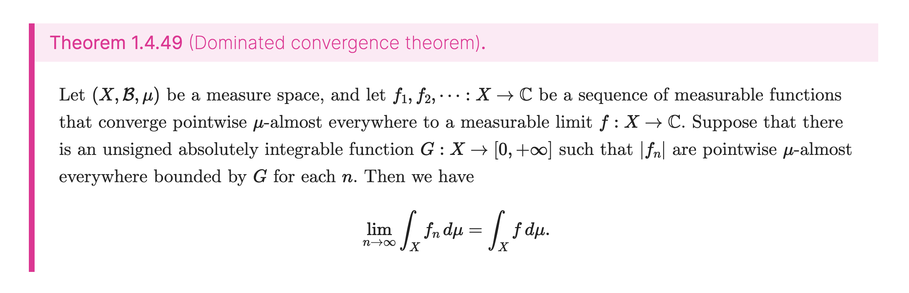
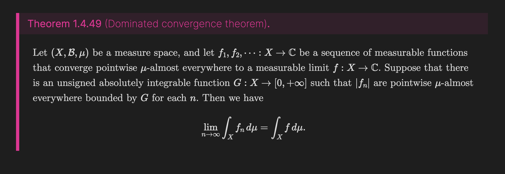

# Math Booster for Obsidian

Turn your Obsidian into ***LaTeX on steroids*** with Math Booster. 

**Math Booster** is an [Obsidian.md](https://obsidian.md/) plugin that enhances your mathematical note-taking experience with several powerful features, including:

- [Theorem environments](https://ryotaushio.github.io/obsidian-math-booster//math-callouts)
- [Equation numbering](https://ryotaushio.github.io/obsidian-math-booster//equation-number)
- [Proof environments](https://ryotaushio.github.io/obsidian-math-booster//proofs) _(experimental)_
- [Live suggestions for theorems/equations](https://ryotaushio.github.io/obsidian-math-booster//suggest)
- [Showing backlinks to theorems/equations](https://ryotaushio.github.io/obsidian-math-booster//backlinks)
- [Live-rendering equations inside callouts & blockquotes](https://ryotaushio.github.io/obsidian-math-booster//math-preview)

Theorems & equations can be **dynamically/automatically numbered**, while you can statically/manually number them if you want.

Thanks to the integration with [MathLinks](https://github.com/zhaoshenzhai/obsidian-mathlinks), links to theorems/equations are [displayed with their title or number](https://ryotaushio.github.io/obsidian-math-booster//cleveref) similarly to the `cleveref` package in LaTeX. (No need for manually typing aliases!)

You can also customize the appearance of theorem callouts using CSS snippets. See the [styles gallery](#styles-gallery) for examples.

See the [documentation](https://ryotaushio.github.io/obsidian-math-booster/) for the details.

Also check out the [No More Flickering Inline Math](https://github.com/RyotaUshio/obsidian-inline-math) plugin that lets you work with inline math much more comfortably.

(The theorem in the screenshot is cited from [Tao, Terence, ed. An introduction to measure theory. Vol. 126. American Mathematical Soc., 2011.](https://terrytao.files.wordpress.com/2012/12/gsm-126-tao5-measure-book.pdf))

## Documentation

https://ryotaushio.github.io/obsidian-math-booster/

## Dependencies

The following community plugins are required to be installed and enabled.

- [MathLinks](https://github.com/zhaoshenzhai/obsidian-mathlinks) version >= 0.4.5
- [Dataview](https://github.com/blacksmithgu/obsidian-dataview) version >= 0.5.56

Also, you need to install the [CMU Serif](https://www.cufonfonts.com/font/cmu-serif) font to fully enjoy some of the preset styles listed below. Additionally, the [Noto Sans JP](https://fonts.google.com/noto/specimen/Noto+Sans+JP) font is required to correctly render proofs using the Japanese profile.

## Installation

Although this plugin is still under review by the Obsidian team, you can install it using BRAT.

1. Install the [BRAT](obsidian://show-plugin?id=obsidian42-brat) community plugin and enable it.
2. Go to **Options**. In the **Beta Plugin List** section, click on the **Add Beta plugin** button.
3. Copy and paste `https://github.com/RyotaUshio/obsidian-math-booster` in the pop-up prompt and click on **Add Plugin**.
5. (Optional) Turn on **Auto-update plugins at startup** at the top of the page.
4. Go to **Community plugins > Installed plugins**. You will find "Math Booster" in the list. Click on the toggle button to enable it.

## Contributing

**I need your help!!**

- Feel free to create a new issue if you noticed something is not working well. Questions are also welcomed.
- Please send a pull request if you have any ideas to improve Math Booster and our experience!
  - **Even if you don't code, your help is still needed for improving the documentation and README.** For exampe, the active update of this plugin has already made some of the images in the documentation outdated...
  - Of course, programmers' contribution is extremely welcomed. (I'm pretty new to TypeScript/JavaScript/HTML/CSS. For me, making this plugin was the only purpose to start learning them. So your help is needed for real.)

## Roadmaps

- Import from LaTeX: ArXiv papers, research/literature notes written in LaTeX, ...
- Export to LaTeX: Write research notes in Obsidian, and then export them into LaTeX.
- More user-friendly UI for local settings

## Styles gallery

### Plain

[View CSS snippet](https://github.com/RyotaUshio/obsidian-math-booster/blob/master/styles/plain.css)

### Framed

[View CSS snippet](https://github.com/RyotaUshio/obsidian-math-booster/blob/master/styles/framed.css)

### MathWiki style

This beautiful style is taken from [MathWiki](https://github.com/zhaoshenzhai/MathWiki). A big thank you to [Zhaoshen Zhai](https://github.com/zhaoshenzhai), the owner of MathWiki and the [MathLinks](https://github.com/zhaoshenzhai/obsidian-mathlinks) plugin, for readily consenting to including it in this documentation.

[View CSS snippet](https://github.com/RyotaUshio/obsidian-math-booster/blob/master/styles/mathwiki.css)

### Vivid

[View CSS snippet](https://github.com/RyotaUshio/obsidian-math-booster/blob/master/styles/vivid.css)

