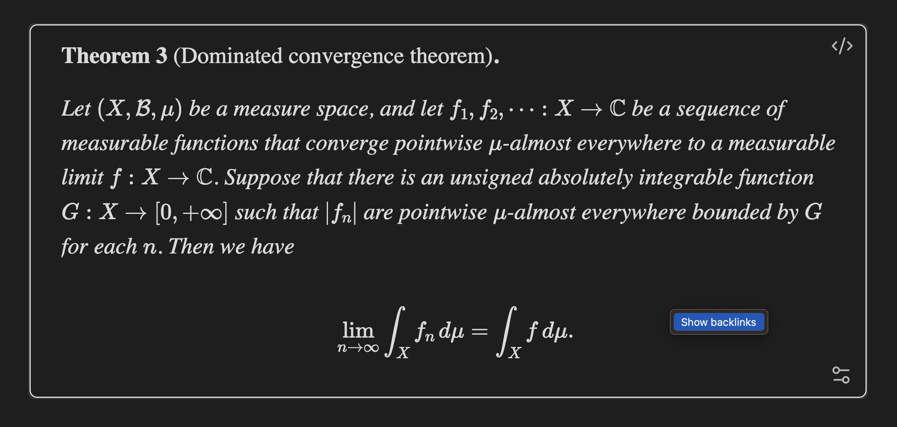
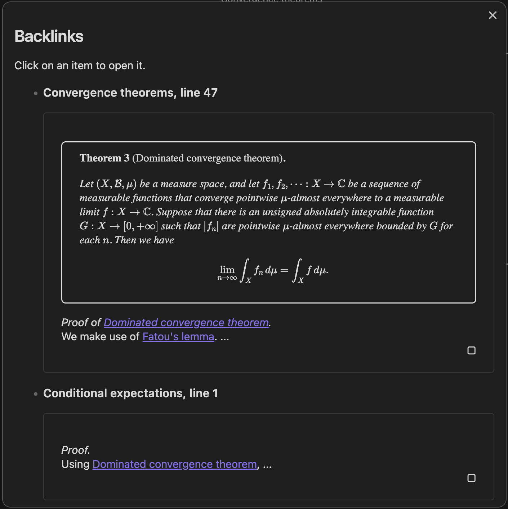
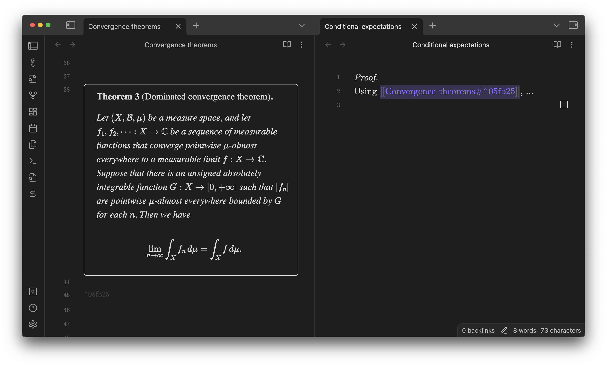

Math Booster makes it easier to connect between theorems/equations by enhancing Obsidian's built-in backlink functionalities.

Right-click on a theorem callout or a numbered equation block.
A context menu is then displayed. Click on **Show backlinks**.

The list of backlinks to the block shows up.

Click an item to jump to it.

