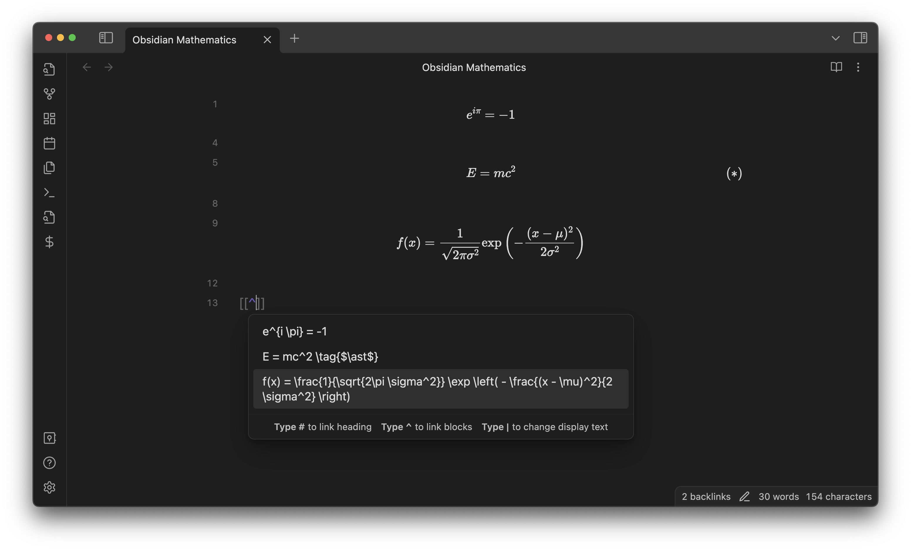
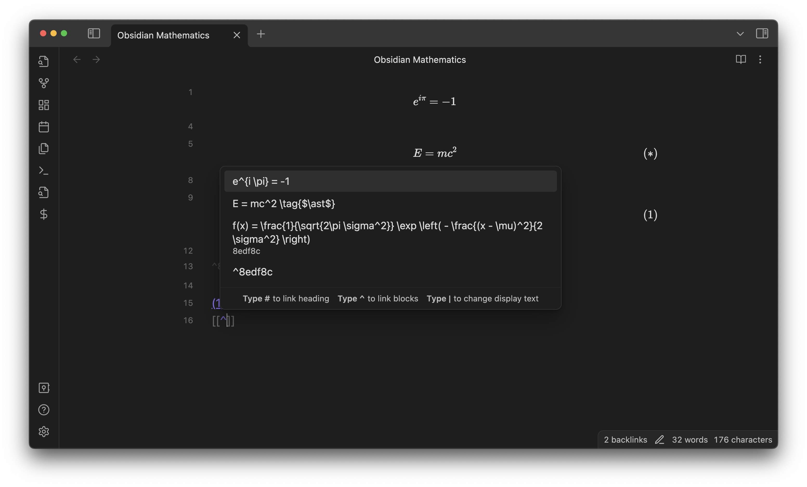
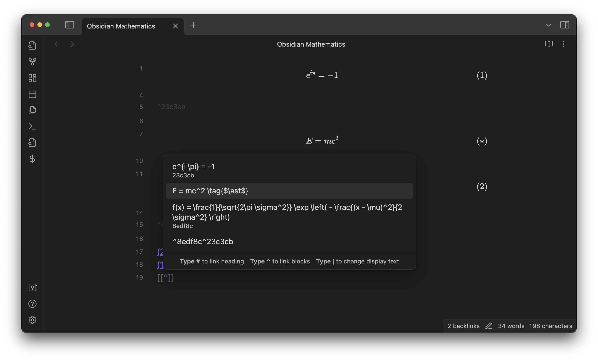
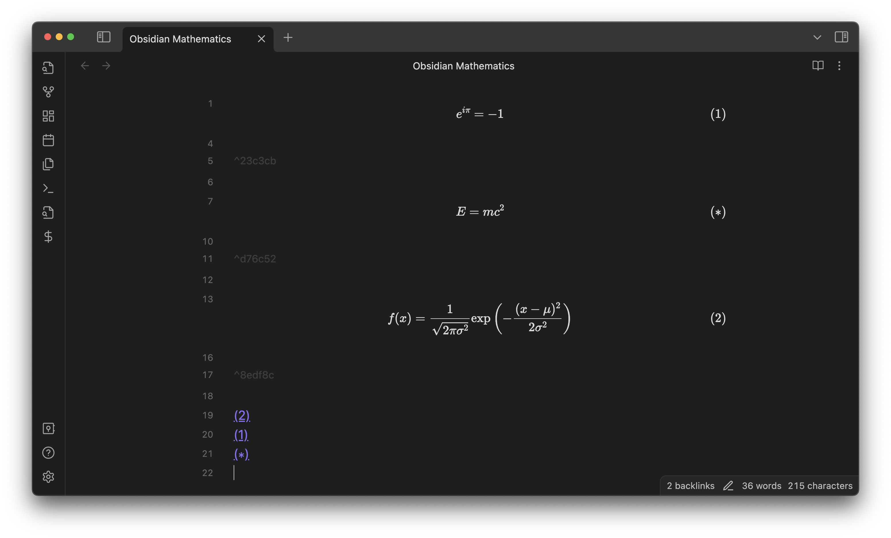
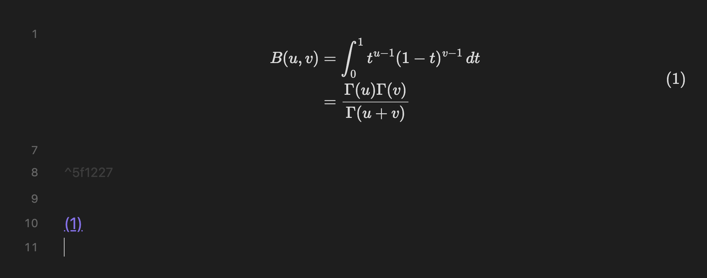
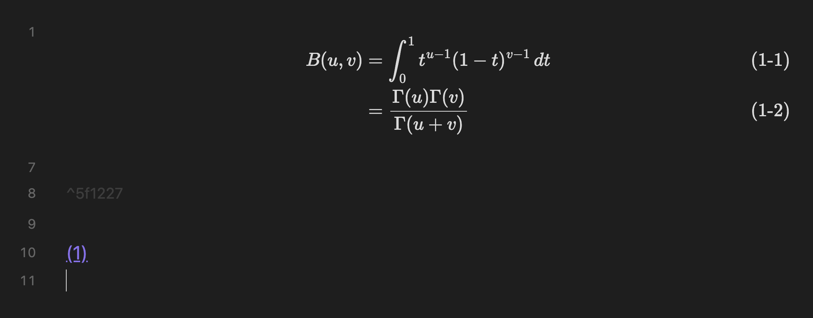

When you insert a link to a math equation block (`[[#^block-ID]]` or `[[note-title#^block-ID]]`), this plugin automatically detects it and assigns an equation number to the equation.

> **Note**: Version 0.6.0 has introduced [Live Suggestions](suggest) to assist with link insertion. Check it out!

For example, suppose you have the following note:

```latex
$$
e^{i \pi} = -1
$$

$$
E = mc^2 \tag{$\ast$}
$$

$$
f(x) = \frac{1}{\sqrt{2\pi \sigma^2}} \exp \left( - \frac{(x - \mu)^2}{2 \sigma^2} \right)
$$
```

Live preview:


Let's [insert a link](https://help.obsidian.md/Linking+notes+and+files/Internal+links#Link+to+a+block+in+a+note) to the last equation.



Then, the equation will be numbered and the link will be displayed with the number assigned to that equation.
(This could take a few seconds because this plugin has to wait until Dataview finishes updating the metadata cache.)


Next, let's insert a link to the equation at the top:



... which reassigns the equation numbers!


As an exception, if your equation has `\tag{...}` already, it will be retained as is.



Result:



Also, if you delete all the links to an equation, ...


... the corresponding equation number will be removed.


> **Tips**: The numbering prefix of theorem callouts or equations can be either automatically inferred from the note title or manually specified.

## Remarks

### Spacing

You must include at least one line break between `$$ ... $$` if you want the equation to be numbered.
Otherwise, Obsidian will not recognize it as a math block.

In other words: 
```latex
Good
$$
f(x)
$$

Good
$$f(x)
$$

Good
$$
f(x)$$

Bad
$$f(x)$$
```

Also, make sure there is an emtpy line under the block ID of the equation. Again, this is needed due to how Obsidian works. **You can enforce this using the [Linter](obsidian://show-plugin?id=obsidian-linter) plugin's rule "[Empty Line Around Math Blocks
](https://platers.github.io/obsidian-linter/settings/spacing-rules/#empty-line-around-math-blocks)."**

### Equations in callouts/blocks

You cannot insert a link to equations in callouts or blockquotes. 
This is an inherent limitation of Obsidian rather than this plugin.[^1]

[^1]: Technically, it is possible to display an equation number for an equation in callouts. However, I think there is no point in doing it if the equation cannot be referenced.

### PDF export

Currently, dynamic equation numbers are not rendered in exported PDFs.
As a quick fix,[^2] you can run the command **Convert equation numbers in the current note to static \\tag{}** to explicitly insert the equation numbers as static LaTeX tags (`\tag{...}`) to avoid this issue.
Make sure you make a backup before this command and undo the tag insertion after exporting finishes.

[^2]: If you have any idea to fix this issue in a cleaner way, let me know via a GitHub issue or pull request!

## The `align` Environment

You can choose whether multi-line equations in an `align` environment are numbered _collectively as a group_:



or _individually_.



Go to the **Number line by line in align** section in the plugin preferences to change the current setting.

When **Number line by line in align** is turned on, you can exclude a line from numbering by inserting `\nonumber`, just like in LaTeX.


