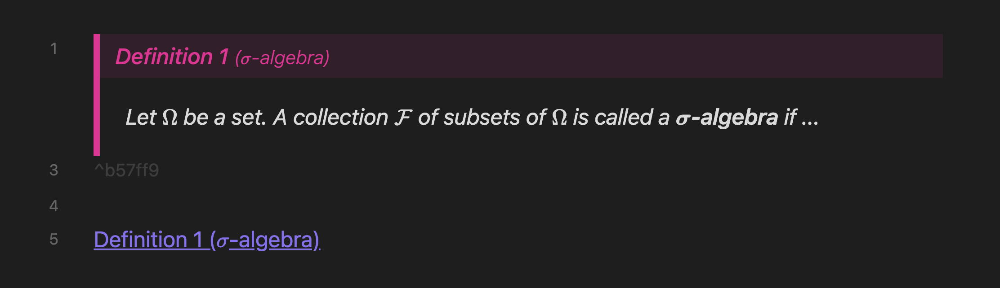
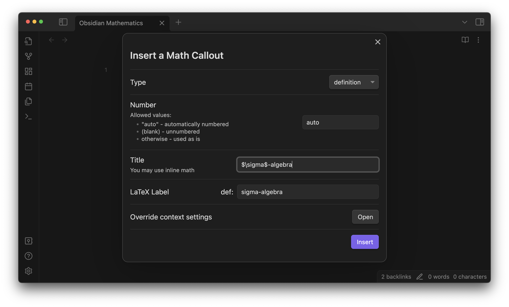
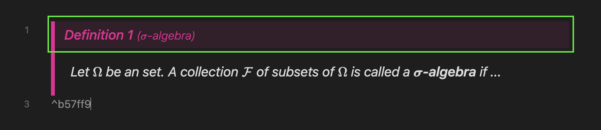
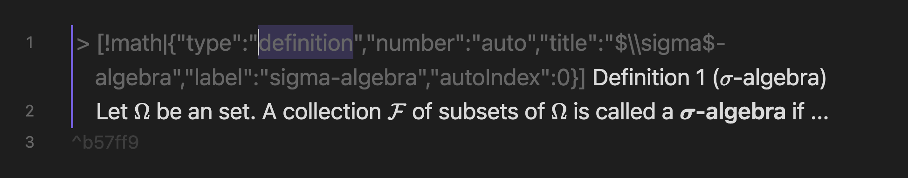
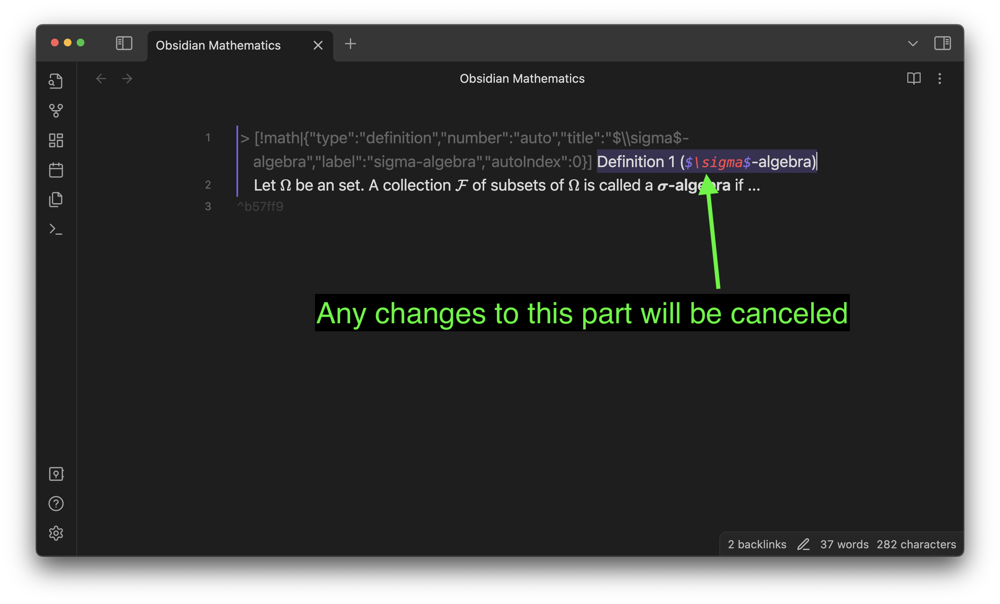

You can insert **math callouts** specifically designed for mathematical theorems, lemmas, propositions, definitions, and so on, just like the `amsthm` package in LaTeX.

- They can be numbered **automatically/dynamically** or **manually/statically**, depending on your preference.
- The links to them are displayed with a prettily formatted title. For example, see the link "Definition 1 (σ-algebra)" in the example below.
- You also have a [fine-grained control](#style-your-theorems) on their appearance via [CSS snippets](https://help.obsidian.md/Extending+Obsidian/CSS+snippets).



## How to use

Open the command palette by <kbd>Ctrl</kbd> + <kbd>P</kbd> and run the command `Insert Math Callout`.
A pop-up will appear, where you can configure the information of the theorem.

For example, the definition callout above was generated by the following setting:



- **Type**: Select from
  - lemma
  - proposition
  - theorem
  - definition
  - corollary
  - ...
- **Number**: Specify how it is numbered
  - "auto" (default): Automatically numbered
  - (blank): Unnumbered
  - otherwise: Manually numbered. The input will be used as is.
- **Title** (optional): If given, the result will be, e.g., "Theorem x.x (`[Title]`)." It can contain inline equations (`$...$`).
- **LaTeX Label** (optional): Later used when converting the notes into a [pandoc-crossref](https://github.com/lierdakil/pandoc-crossref)-friendly format.
- **Override Context Settings**

### Modify settings afterward

Click the title bar of an existing math callout to modify its settings.



Alternatively, you can directly edit the JSON metadata, although I don't recommend it since it will be error-prone.



Also note that, if you make any changes directly to the selected area in the image below, they will be canceled.
If you want to change the title, click on the title bar of the math callout and edit the **Title** section in the pop-up setting window (or edit the JSON).



## Style Your Theorems

You can customize the appearance of math callouts to be specific to languages or environments (theorem/definition/...). This can be done using CSS snippets (and Style Settings Plugin in the near future).

### CSS classes defined by this plugin

- `.math-callout-{type}`: Indicates the environment type. For example, a math callout whose type is "theorem" will be given the `.math-callout-theorem` class.
- `.math-callout-{language code}`: Indicates the language used for the math callout. Currently only `en` and `ja` are available.

### Obsidian built-in CSS classes

- `.callout[data-callout="math"]`
  - `.callout[data-callout="math"] > .callout-title`
    - `.callout[data-callout="math"] > .callout-title > .callout-icon`
    - `.callout[data-callout="math"] > .callout-title > .callout-title-inner`
  - `.callout[data-callout="math"] > .callout-content`

### Style examples

The example above is styled with the following CSS snippet:

```css

.callout[data-callout="math"] {
    --callout-color: 238, 15, 149;
    border-left: 5px solid rgb(var(--callout-color));
    border-radius: 0px;
    padding: 0px;
}

.callout[data-callout="math"]>.callout-title {
    padding: 6px;
    padding-left: 12px;
}

.callout[data-callout="math"]>.callout-title>.callout-icon {
    display: none;
}

.callout[data-callout="math"]>.callout-title>.callout-title-inner {
    font-weight: 500;
    /*500*/
    color: rgb(var(--callout-color));
}

.callout[data-callout="math"]>.callout-content {
    background-color: var(--background-primary);
    padding: 1px 20px 2px 20px;
}

.callout[data-callout="math"].math-callout-en > .callout-title > .callout-title-inner {
    font-style: italic;
}

.callout[data-callout="math"] > .callout-title > .callout-title-inner > .math-callout-subtitle {
    font-weight: 300;
    font-size: 85%;
}

.callout[data-callout="math"].math-callout-en>.callout-content {
    font-style: italic;
}
```
