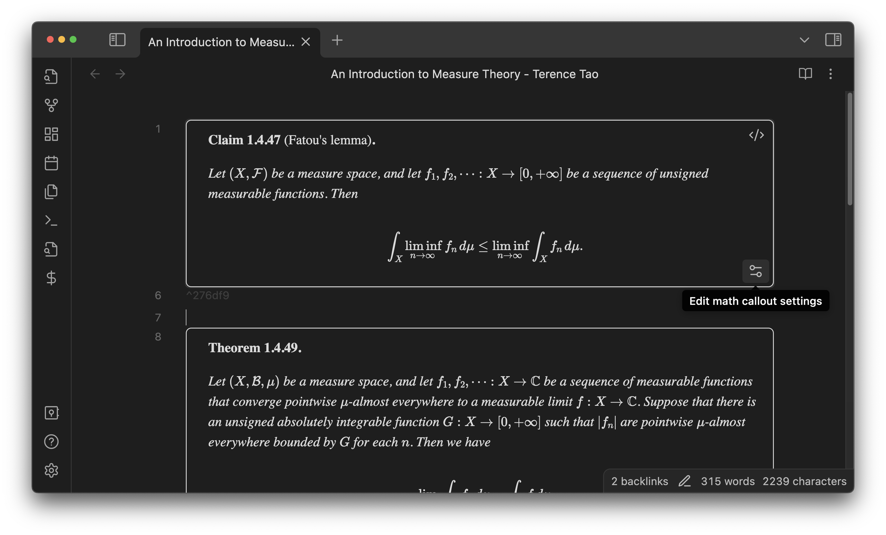

You can insert **theorem callouts** specifically designed for mathematical theorems, lemmas, propositions, definitions, and so on, just like theorem environments in LaTeX.

- They can be numbered **automatically/dynamically** or **manually/statically**, depending on your preference.
- The links to them are displayed with a prettily formatted title. For example, see the link "Theorem 1 (Dominated convergence theorem)" in the example below.
- You can customize their appearance using [preset styles](style-your-theorems.md#styles-gallery). Also, [CSS snippets](https://help.obsidian.md/Extending+Obsidian/CSS+snippets) lets you have a [finer-grained control](style-your-theorems).

## How to use

Open the command palette by <kbd>Ctrl</kbd> + <kbd>P</kbd> and run the command `Insert theorem callout`.
A pop-up will appear, where you can configure the information of the theorem.

For example, the theorem callout above was generated by the following setting:

- **Type**: Select from
  - lemma
  - proposition
  - theorem
  - definition
  - corollary
  - ...
- **Number**: Specify how it is numbered
  - "auto" (default): Automatically numbered
  - blank: Unnumbered
  - otherwise: Manually numbered. The input will be used as is.
- **Title** (optional): If given, the result will be, e.g., "Theorem x.x ([Title])." It can contain inline equations (`$...$`).
- **Pandoc label** (optional): Later used when converting the notes into a [pandoc-crossref](https://github.com/lierdakil/pandoc-crossref)-friendly format. You need to care about this only if you convert your notes to LaTeX or other formats in the future. *This conversion feature is not implemented yet.*
- **Use this theorem callout to set this note's mathLink**: See [MathLinks integration](mathlinks) for the details.
- **Open local settings for the current note**: See [local settings](context-settings) for the details.

> **Tips**: The numbering prefix of theorem callouts or equations can be either automatically inferred from the note title or manually specified.

### Modify settings afterward

Click the **Edit theorem callout settings** button to change the settings of an existing theorem callout.

