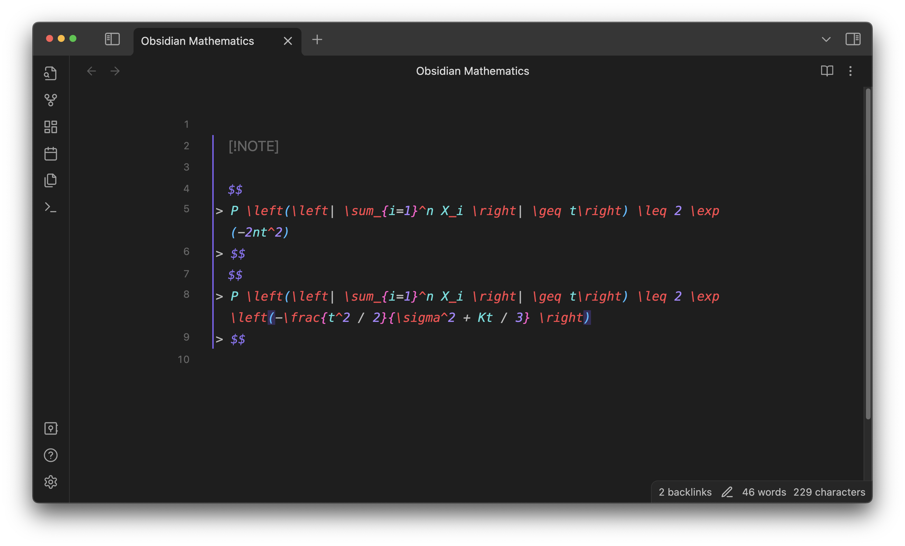
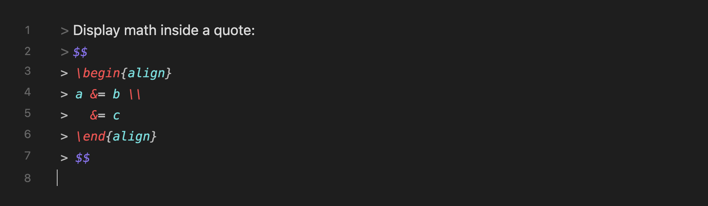
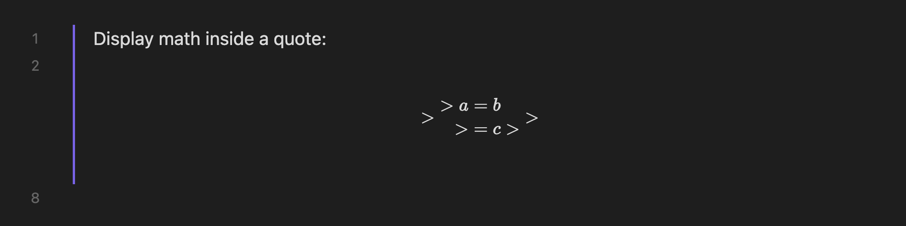
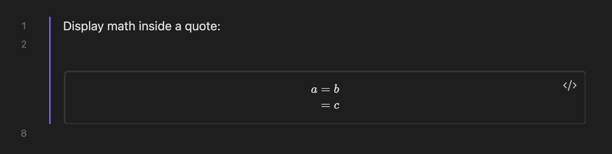

## Callouts

Obsidian doesn't render MathJax equations in callouts _while editing them_, as shown below:

This plugin gets this job done and makes your math note taking much more seamless.

## Blockquotes

Obsidian natively supports math rendering inside blockquotes, but it breaks when you use line breaks inside a math (as reported in the [forum](https://forum.obsidian.md/t/live-preview-support-math-block-in-quotes/32564)).

With Math Booster, you will no longer have this nightmare!

For example, suppose you have the following equation:

Without Math Booster, it is rendered like this. Totally collapsed.

Now, turn on Math Booster:

Cool!
