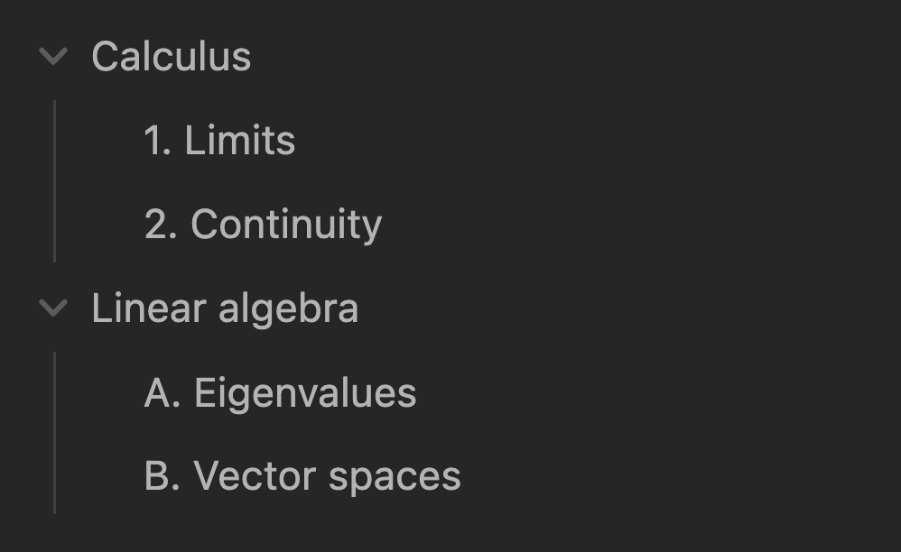
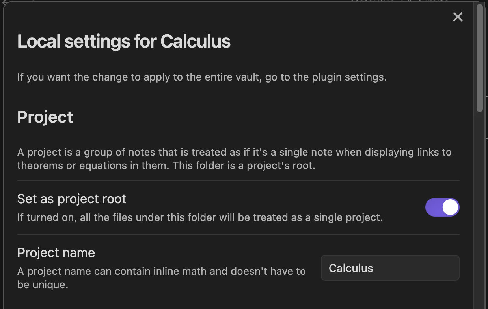

A **project** is a group of notes that is treated as if it were a single note when displaying links to theorems in them.

Suppose your vault looks like below. 
There are two folders (`Calculus` & `Linear algebra`), each corresponding to a class.

`Calculus/2. Continuity.md` references `Definition 1.1` in `Calculus/1. Limits.md`:

Since the target note `1. Limits.md` belongs to the same calculus class as `2. Continuity.md`, 
it would be more natural if the link `1. Limits > Definition 1.1 (Limits)` could be displayed as just `Definition 1.1 (Limits)`.
In other words, the entire `Calculus` folder should be treated as if it were a single note.

This is what a project does.
Open the local settings pop-up by right-clicking on the `Calculus` folder (note that it can be opened in [other ways](context-settings#how-to-set-up-local-settings), too).

Turn on **Set as project root**.
This registers the `Calculus` folder as a single project.

Now, the link is rendered just as expected.

Next, go to `Linear algebra/A. Eigenvalues.md` and insert a link to the same definition.
Since we are now outside the `Calculus` project, the link is displayed with the project name (which is treated as if it were a note title!).

## Advanced

- A project is named after the root folder/note by default, but you can rename it as you like.
- A project name can contain inline math `$...$`.
- A project's root can be either a folder or note, although it might be less helpful to set a single note as a project.
- Projects can be nested.
- Go to the **Projects** section in the plugin settings to further configure how project links are displayed.
