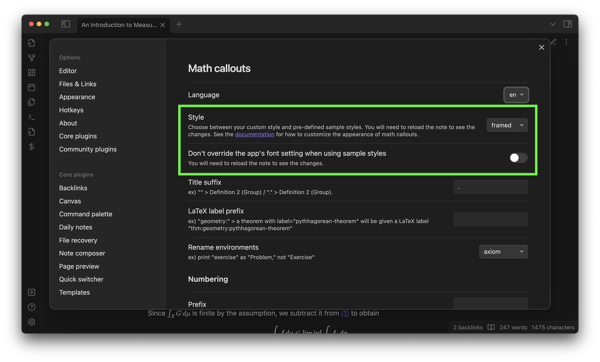

You can customize the appearance of math callouts either by **your own custom [CSS snippets](https://help.obsidian.md/Extending+Obsidian/CSS+snippets)** or by **[preset sample styles](#styles-gallery)**.

In the plugin settings, set **Math Callouts > Style** to be **custom** if you want to use your custom CSS snippets. 
Math Booster defines several [custom CSS classes](#math-boosters-custom-classes), allowing you to change the styles depending on specific languages or environments (theorem/definition/...).

Otherwise, the selected preset style will be applied. You need to reopen the note to see the style change.
When **Don't override the app's font setting when using sample styles**, the preset style will not change the default font family defined in the app's **Settings > Appearance > Font > Text font**.

## CSS classes

### Obsidian built-in classes

- `.callout`
  - `.callout > .callout-title`
    - `.callout > .callout-title > .callout-icon`
    - `.callout > .callout-title > .callout-title-inner`
  - `.callout > .callout-content`

### Math Booster's custom classes

- `.math-callout`: Assigned to all math callouts. You can use it as an alternative to `.callout[data-callout="math"]`.
- `.math-callout-{type}`: Indicates the environment type. For example, a math callout whose type is "theorem" will be given the `.math-callout-theorem` class.
- `.math-callout-{language code}`: Indicates the language used for the math callout. Currently only `en` and `ja` are available.
- `.math-callout-subtitle`: Corresponds to the **title** field in the math callout settings. Lives inside `.callout-title-inner`. Ex) Theorem 1.1 (here is `.math-callout-subtitle`)

## Styles gallery

Here are the list of preset sample styles. You can also view the CSS snippet generating each style.

Example theorem cited from: [Tao, Terence, ed. An introduction to measure theory. Vol. 126. American Mathematical Soc., 2011.](https://terrytao.files.wordpress.com/2012/12/gsm-126-tao5-measure-book.pdf)

### Plain

[View CSS snippet](https://github.com/RyotaUshio/obsidian-math-booster/blob/master/styles/plain.css)

### Framed

[View CSS snippet](https://github.com/RyotaUshio/obsidian-math-booster/blob/master/styles/framed.css)

### MathWiki style

This beautiful style is taken from [MathWiki](https://github.com/zhaoshenzhai/MathWiki). A big thank you to [Zhaoshen Zhai](https://github.com/zhaoshenzhai), the owner of MathWiki and the [MathLinks](obsidian://show-plugin?id=mathlinks) plugin, for readily consenting to including it in this documentation.

[View CSS snippet](https://github.com/RyotaUshio/obsidian-math-booster/blob/master/styles/mathwiki.css)

### Vivid

[View CSS snippet](https://github.com/RyotaUshio/obsidian-math-booster/blob/master/styles/vivid.css)
