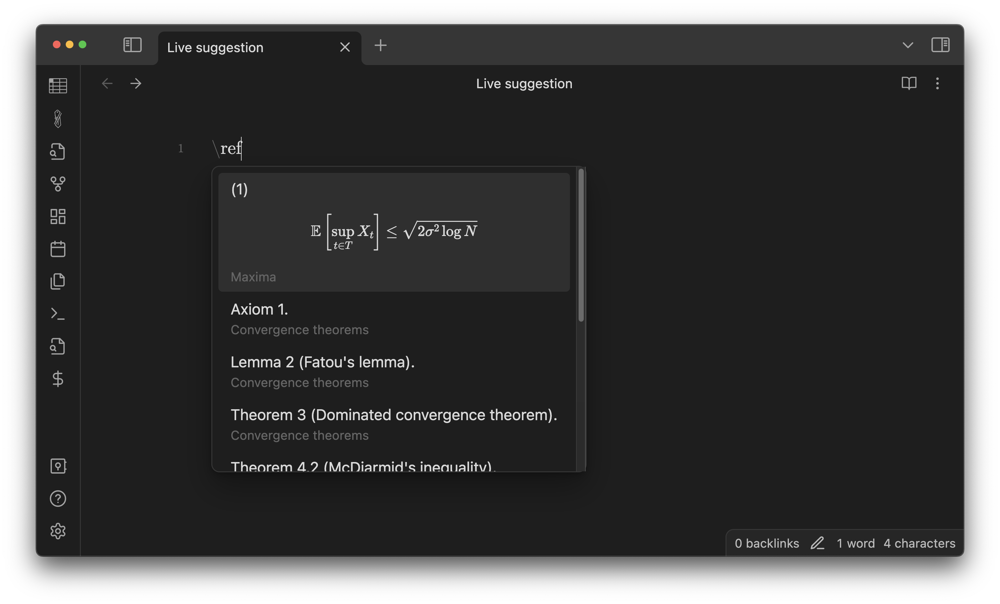
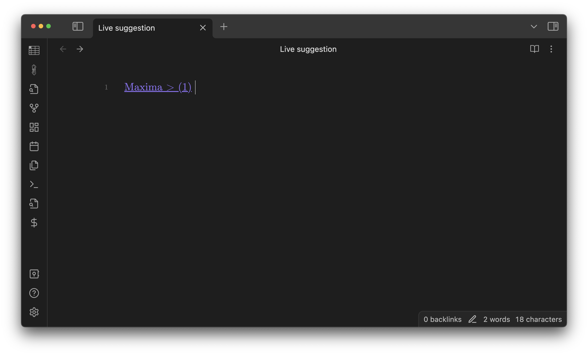
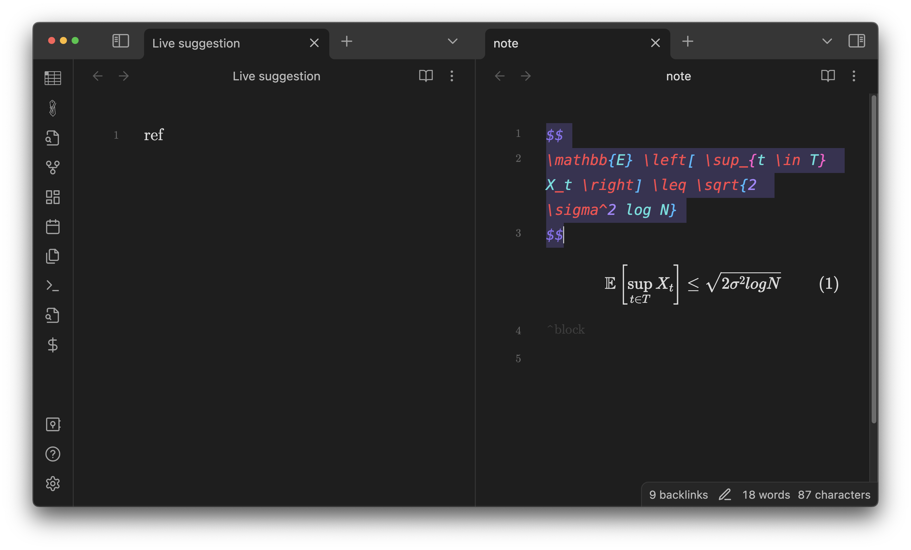
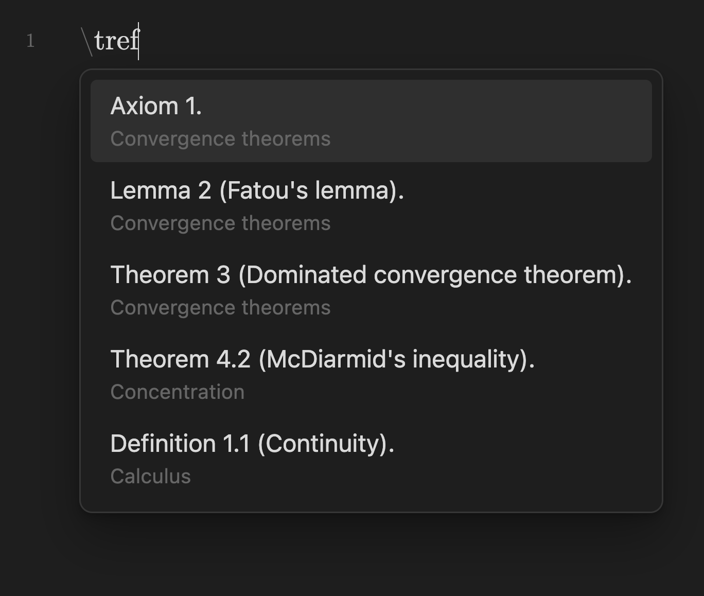
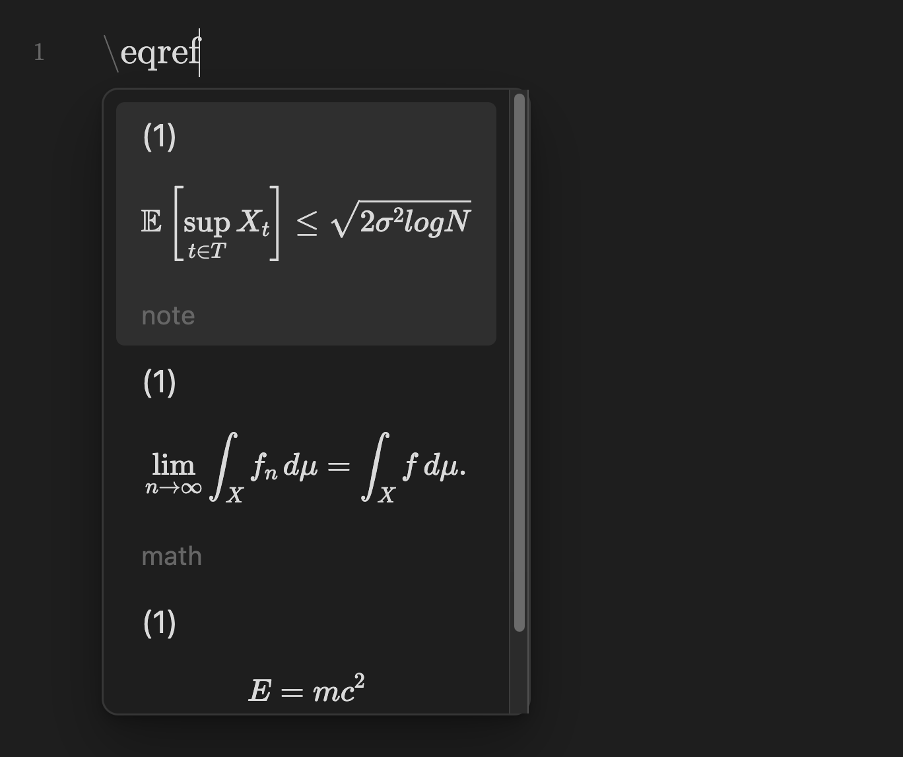
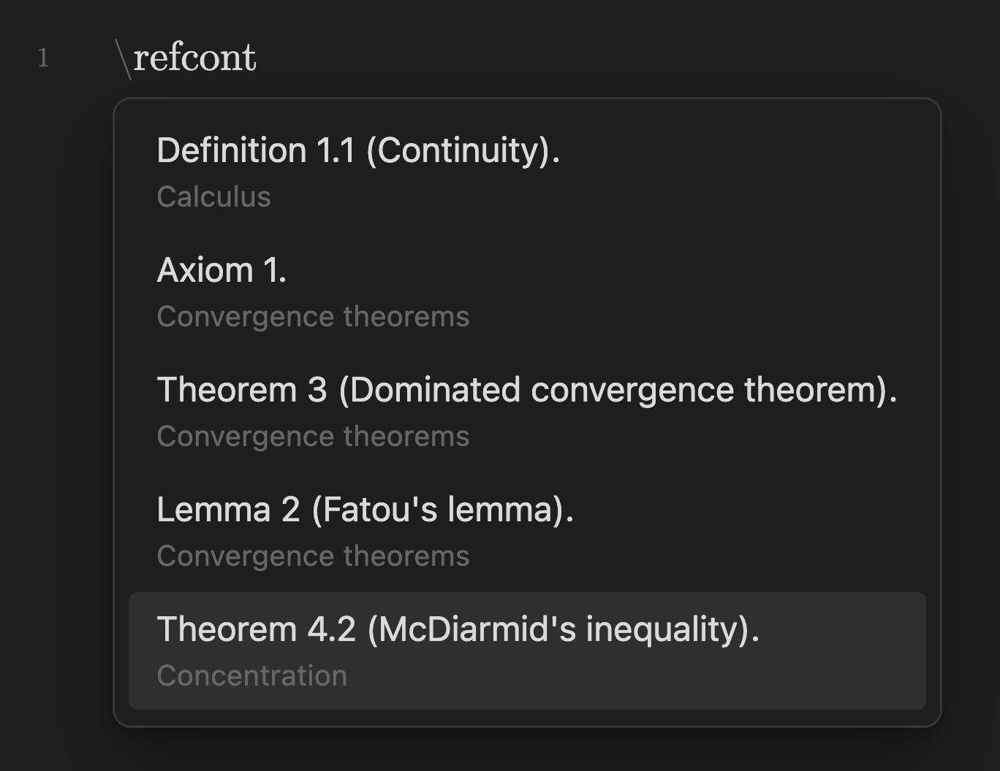
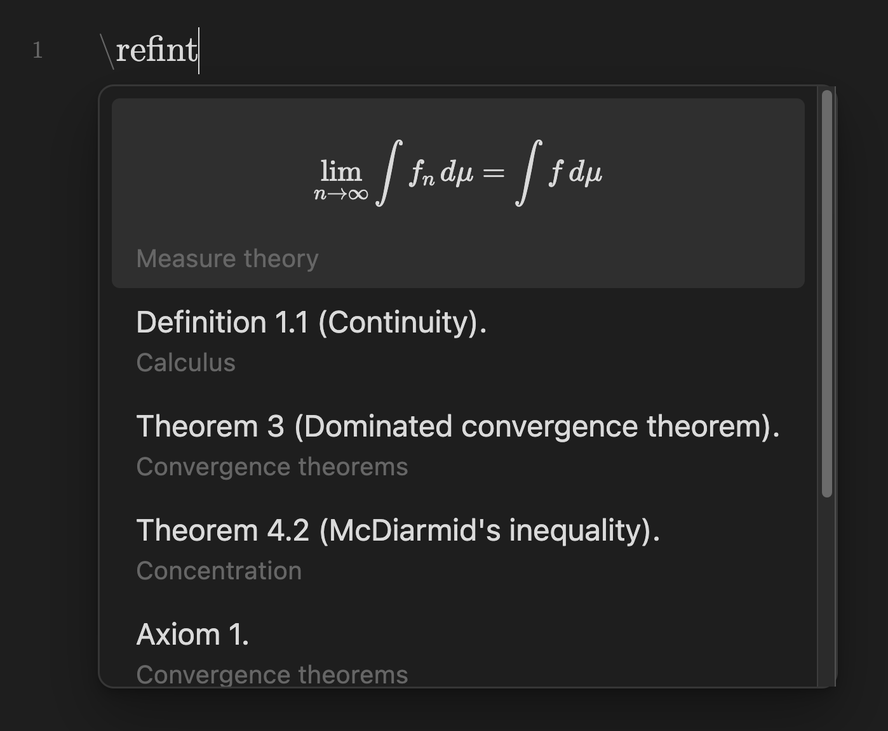

Math Booster lets you insert links to theorems or equations with ease.

In the editor, type `\ref` (by default; you can change it as you like in the plugin settings).
Then, live suggestions for all theorem callouts & equation blocks in the entire vault show up.

Press <kbd>Enter</kbd> to insert a link to the selected item.

Or you can jump to the selected item by pressing <kbd>Cmd</kbd> + <kbd>Enter</kbd> on Mac / <kbd>Ctrl</kbd> + <kbd>Enter</kbd> on Windows.

Use `\tref` or `\eqref` (by default) instead of `\ref` to suggest only theorems or only equations.

  

    
  

  

    
  

## Available search keys

### Theorem suggestion

| Key              | Example                   |
| ---------------- | ------------------------- |
| Environment type | definition, theorem, ...  |                                                
| Formatted title  | Definition 1.1 (Continuity) |                                                
| Formatted label  | def:continuity              |                                                
| Note path        | folder/note.md            |
| Tags             | #calculus                          | 

### Equation suggestion

| Key                         | Example        |
| --------------------------- | -------------- |
| Equation number (if exists) | (1)            |
| LaTeX source code | `\lim_{n \to \infty} \int f_n \, d\mu = \int f \, d\mu` |
| Note path                   | folder/note.md |
| Tags                        | #measure-theory      |

## Remark

This feature inserts wikilinks (i.e. `[[]]`) even if you are turning off **Use [[Wikilinks]]** in the app settings because markdown links are not suitable for dynamically updating the displayed text.